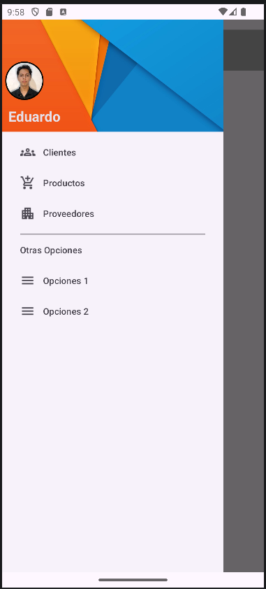

# App6 — Navigation View


-----

|Campo      |Detalle                                              |
|-----------|-----------------------------------------------------|
|Universidad|Universidad Técnica Estatal de Quevedo (UTEQ)        |
|Facultad   |Facultad de Ciencias de la Computación (FCC)         |
|Carrera    |Software                                             |
|Materia    |Aplicaciones Móviles — SOFT-R-A · 6to Nivel · Corte 1|
|Tema       |Navigation View                                      |
|Estudiante |Eduardo Reinoso Vélez                                |

-----

## Objetivo

Implementar un menú de navegación lateral (*Navigation Drawer*) en Android utilizando Kotlin y los componentes de Material Design 3, permitiendo al usuario navegar entre secciones de la aplicación mediante ítems agrupados, cabecera personalizada con foto y nombre de usuario.

-----

## Tecnologías

|Tecnología / Herramienta   |Versión|Propósito                                 |
|---------------------------|-------|------------------------------------------|
|Kotlin                     |1.9.x  |Lenguaje principal                        |
|Android SDK                |API 24+|Plataforma de ejecución                   |
|Material Components Android|1.11.x |`NavigationView`, `DrawerLayout`, cabecera|
|ConstraintLayout           |2.1.x  |Layout base de actividades                |
|Gradle (KTS)               |8.x    |Sistema de construcción                   |
|Android Studio Panda       |4.x    |IDE de desarrollo                         |

-----

## Arquitectura

La aplicación sigue el patrón **Single Activity** con un `DrawerLayout` como contenedor raíz. El `NavigationView` carga ítems definidos en un menú XML y una cabecera con imagen de perfil y nombre de usuario. La `MainActivity` gestiona la selección de ítems mediante `setNavigationItemSelectedListener`.

```
MainActivity
├── DrawerLayout (raíz)
│   ├── ConstraintLayout (contenido principal)
│   │   └── Toolbar
│   └── NavigationView
│       ├── nav_header.xml  (cabecera: foto + nombre)
│       └── menu/nav_menu.xml
│           ├── Grupo 1: Clientes, Productos, Proveedores
│           └── Grupo 2 (Otras Opciones): Opciones 1, Opciones 2
```

-----

## Estructura del proyecto

```
App6/
├── app/
│   └── src/
│       └── main/
│           ├── java/com/example/app6/
│           │   └── MainActivity.kt
│           └── res/
│               ├── drawable/
│               │   └── ic_profile.png          # Imagen de cabecera
│               ├── layout/
│               │   ├── activity_main.xml        # DrawerLayout + NavigationView
│               │   └── nav_header.xml           # Cabecera del drawer
│               └── menu/
│                   └── nav_menu.xml             # Ítems del menú lateral
├── build.gradle.kts
├── gradle.properties
└── settings.gradle.kts
```

-----

## Funcionalidades implementadas

La aplicación implementa un menú de navegación lateral compuesto por dos grupos: el primero agrupa las secciones principales (Clientes, Productos, Proveedores), y el segundo contiene opciones adicionales bajo el encabezado *Otras Opciones* (Opciones 1, Opciones 2). La cabecera del drawer muestra una imagen de perfil circular y el nombre del usuario. El ítem activo se resalta visualmente mediante el comportamiento predeterminado de `NavigationView`. El drawer se abre y cierra con el botón de hamburguesa en la `Toolbar`.

-----

## Instalación y ejecución

**Requisitos previos:** Android Studio Panda 4, SDK Android API 24 o superior, dispositivo físico o emulador.

1. Clonar el repositorio:
   
   ```bash
   git clone https://github.com/ereinosov/App6.git
   ```
1. Abrir la carpeta `App6/` en Android Studio.
1. Sincronizar Gradle desde **File → Sync Project with Gradle Files**.
1. Ejecutar con **Run → Run ‘app’** (`Shift + F10`) sobre un dispositivo o emulador.

No se requiere configuración de credenciales ni variables de entorno.

-----

## Dependencias principales

```kotlin
// build.gradle.kts (app)
dependencies {
    implementation("com.google.android.material:material:1.11.0")
    implementation("androidx.constraintlayout:constraintlayout:2.1.4")
    implementation("androidx.appcompat:appcompat:1.6.1")
}
```

-----

## Capturas de pantalla



-----


-----

*Universidad Técnica Estatal de Quevedo · FCC · Carrera Software · 2026*
